<p align="center">
  <a href="https://www.linkedin.com/in/analyticalrohit" style="text-decoration:none;">
    
  </a>
  <a href="https://awesomeneuron.substack.com/" style="text-decoration:none;">
    
  </a>
   <a href="https://x.com/_rohit_tiwari_" style="text-decoration:none;">
    
  </a>
     <a href="https://www.youtube.com/@awesomeneuron?sub_confirmation=1" style="text-decoration:none;">
    
  </a>
     <a href="https://topmate.io/analyticalrohit" style="text-decoration:none;">
    
  </a>
</p>

# LLMs from Scratch

## Overview
This repository is a hands on guide to building a ChatGPT like LLM in PyTorch. It breaks the architecture into simple parts and explains each one step by step.

## LLM Architecture

Let us have a bird's eye view of the Generative Pretrained Transformer (GPT) like LLM architecture.

Example: *Every moment is a beginning*

<p align="center">
  <a href="https://awesomeneuron.substack.com/">
    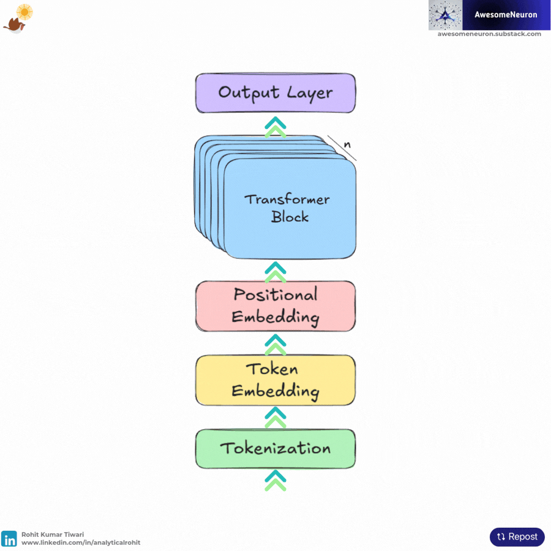
  </a>
</p>


LLMs work by predicting one token at a time. LLMs generate text iteratively. Each predicted token is appended to the previous input to form the context for the next prediction.

## Contents

- [Tokenization](#tokenization)
- [Token Embeddings](#token-embeddings)
- [Positional Embeddings](#positional-embeddings)
- [Self Attention Mechanism](#self-attention-mechanism)
- [Masked Multi-Head Attention](#masked-multi-head-attention)
- [Feedforward Neural Networks](#feedforward-neural-networks)
- [Residual Connections](#residual-connections)
- [Layer Normalization](#layer-normalization)
- [Transformer Block](#transformer-block)
- [MiniGPT](#minigpt)

## Code Notebook

Dive into the hands-on examples for each LLM component using interactive Jupyter notebooks.

| Topic                     | Code |
|---------------------------|------|
| Tokenization              | [01_tokenization.ipynb](./notebooks/01_tokenization.ipynb) |
| Token Embeddings          | [02_token_embeddings.ipynb](./notebooks/02_token_embeddings.ipynb) |
| Positional Embeddings     | [03_positional_embeddings.ipynb](./notebooks/03_positional_embeddings.ipynb) |
| Self Attention Mechanism  | [04_self_attention_mechanism.ipynb](./notebooks/04_self_attention_mechanism.ipynb) |
| Masked Multi-Head Attention | [05_masked_multi_head_attention.ipynb](./notebooks/05_masked_multi_head_attention.ipynb) |
| Feedforward Neural Networks| [06_feedforward_neural_networks.ipynb](./notebooks/06_feedforward_neural_networks.ipynb) |
| Residual Connections      | [07_residual_connections.ipynb](./notebooks/07_residual_connections.ipynb) |
| Layer Normalization       | [08_layer_normalization.ipynb](./notebooks/08_layer_normalization.ipynb) |
| Transformer Block         | [09_transformer_block.ipynb](./notebooks/09_transformer_block.ipynb) |
| MiniGPT                   | [10_mini_gpt.ipynb](./notebooks/10_mini_gpt.ipynb) |

## Install Dependencies
```
pip install -r requirements.txt
```
If you're installing torch with CUDA support, make sure to use the correct installation command from [PyTorch's official website](https://pytorch.org/get-started/locally/), as some versions require a specific installation method.

## Tokenization

Tokenization is the process of splitting a text into smaller units called tokens. These tokens are the fundamental building blocks an LLM works with.

Input Sentence: “Every moment is a beginning”

Tokens: [“Every”, “moment”, “is”, “a”, “beginning”]

This shows how a tokenizer can split a sentence into tokens. After tokenization, each unique token is assigned a unique numerical ID.

Here’s a simple visual showing tokenization:

<p align="center">
  <a href="https://awesomeneuron.substack.com/">
    
  </a>
</p>

## Token Embeddings

Now we have a list of numbers, but these numbers alone don’t carry any meaning. The ID “15745” for “Every” does not contain information about how the token is used in language. This is where embeddings help.

Token Embeddings are essentially numerical representations (vectors) of tokens basically a long list of numbers (a vector) that describes its characteristics.

<p align="center">
  <a href="https://awesomeneuron.substack.com/">
    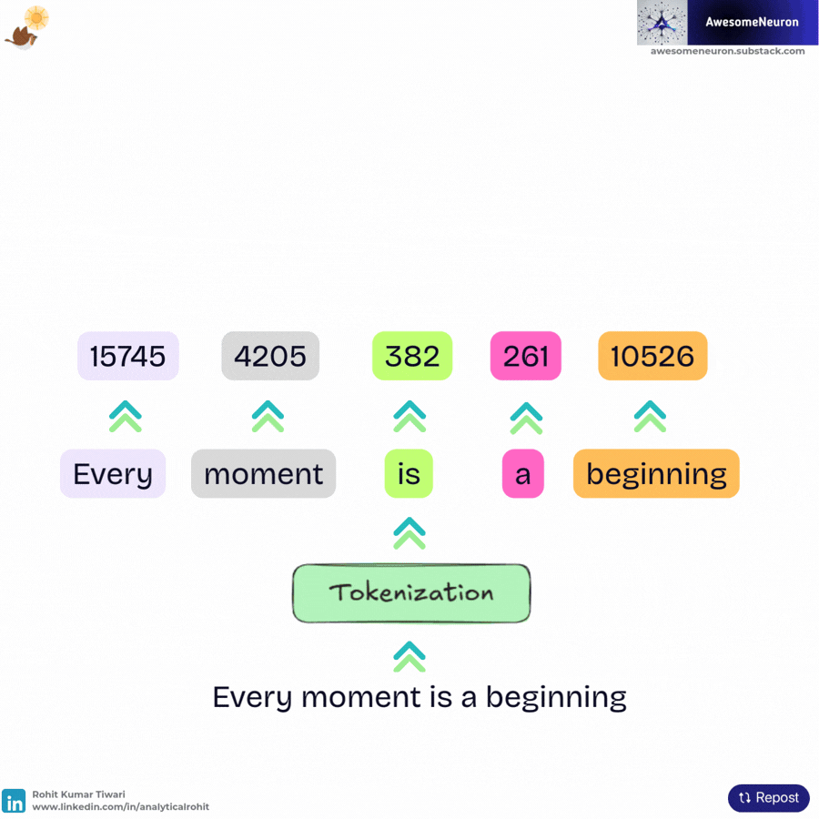
  </a>
</p>

## Positional Embeddings

Imagine the sentences:

- The dog jumps on the cat.
- The cat jumps on the dog.

The words are the same, but the meaning is entirely different because their positions are different. Our numerical token IDs and token embeddings, by themselves, don’t tell the LLM anything about the order of words.

This is solved with Positional Embeddings.

Positional embeddings are another list of numbers (a vector) added to the token embeddings. These vectors help the model understand the absolute or relative position of each token in the sequence.

<p align="center">
  <a href="https://awesomeneuron.substack.com/">
    
  </a>
</p>

## Self Attention Mechanism

The Self Attention Mechanism allows the model to understand how words relate to each other. Instead of reading each word in isolation, every token looks at the other tokens and decides which ones matter most.

Take this sentence:

“Every moment is a beginning.”

To understand the word “beginning”, the model pays attention to words like “moment” and “Every”. This gives context and helps the model capture the idea that each moment can represent a fresh start.

$$\text{Attention}(Q, K, V) = \text{softmax}\left(\frac{QK^T}{\sqrt{d_k}}\right).V$$

**Step 1**: To achieve this mathematically, the model uses three vectors derived from the input embeddings: Queries (Q), Keys (K), and Values (V). 

<p align="center">
  <a href="https://awesomeneuron.substack.com/">
    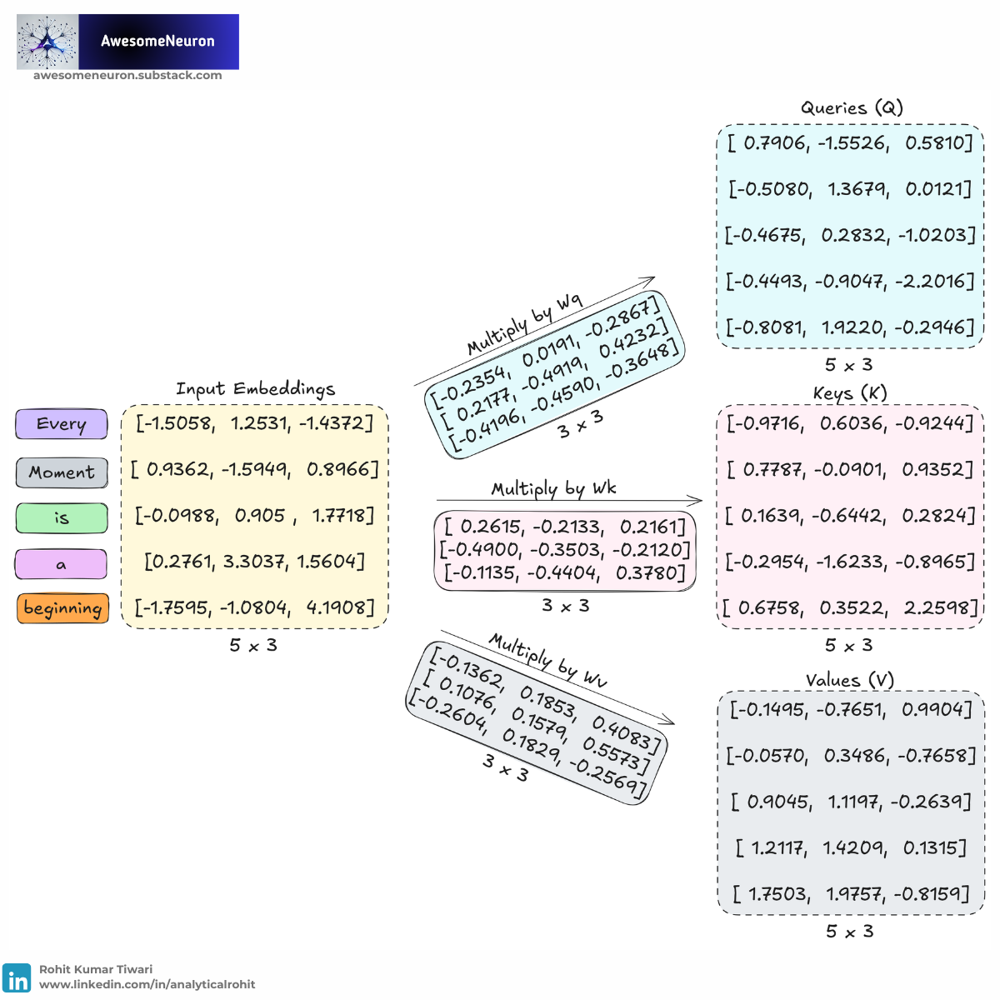
  </a>
</p>

**Step 2**: We compute the dot product between all Queries and Keys to measure how well they match.

$$\text{Attention Scores} = QK^T$$

<p align="center">
  <a href="https://awesomeneuron.substack.com/">
    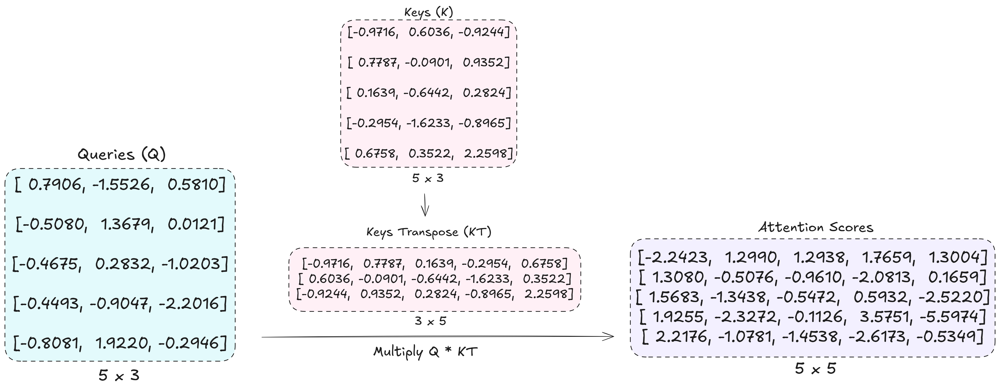
  </a>
</p>

**Step 3**: The result is scaled by the square root of the key dimension dk to keep values stable during training.

$$\text{Scaled Attention Scores} = \frac{QK^T}{\sqrt{d_k}}$$

<p align="center">
  <a href="https://awesomeneuron.substack.com/">
    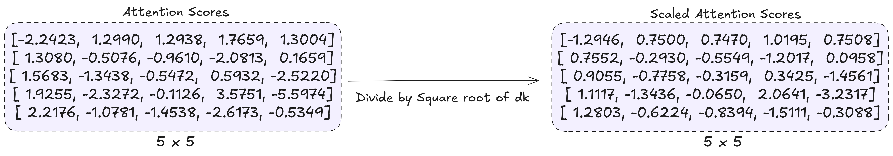
  </a>
</p>

**Step 4**: Apply softmax to obtain attention weights.

$$\text{Attention Weights} = \text{softmax}\left(\frac{QK^T}{\sqrt{d_k}}\right)$$

<p align="center">
  <a href="https://awesomeneuron.substack.com/">
    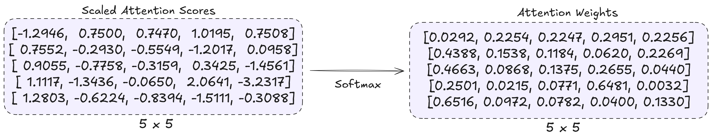
  </a>
</p>

**Step 5**: Calculate context vectors.

$$\text{Context Vectors} = \text{Attention Weights} \cdot V = \text{Attention}(Q, K, V)$$

<p align="center">
  <a href="https://awesomeneuron.substack.com/">
    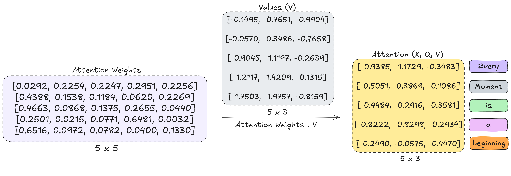
  </a>
</p>

**Complete Self Attention**

<p align="center">
  <a href="https://awesomeneuron.substack.com/">
    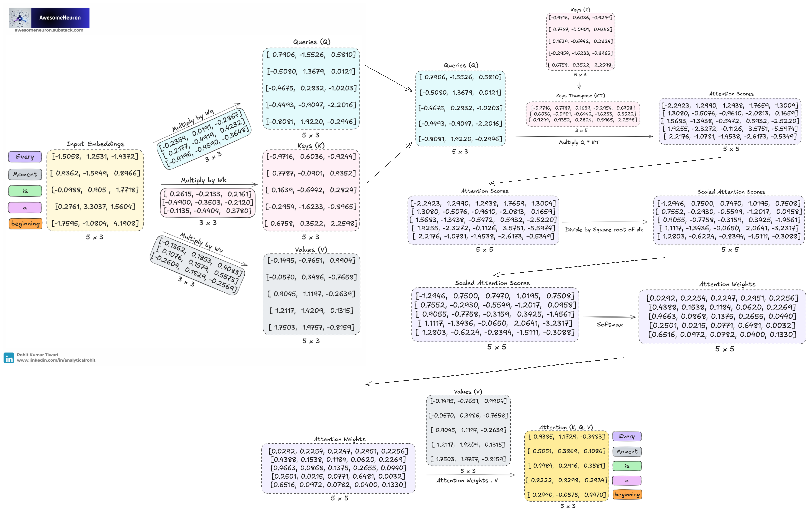
  </a>
</p>

After attention, each token now contains information gathered from other tokens in the sequence. This is the core idea behind transformers.

In standard self attention, each token can attend to all other tokens in the sequence. But in language models, future tokens should not be visible during prediction.

Causal self attention solves this using a mask that blocks access to future tokens.

The mask looks like this:

$$\begin{bmatrix}
1 & 0 & 0 & 0 & 0 \\
1 & 1 & 0 & 0 & 0 \\
1 & 1 & 1 & 0 & 0 \\
1 & 1 & 1 & 1 & 0 \\
1 & 1 & 1 & 1 & 1
\end{bmatrix}$$

- `1` means attention is allowed
- `0` means attention is blocked

This is implemented by masking the blocked positions and replacing their attention scores with negative infinity before applying the softmax function. After softmax, these positions receive a probability of 0, preventing the model from attending to future tokens.

<p align="center">
  <a href="https://awesomeneuron.substack.com/">
    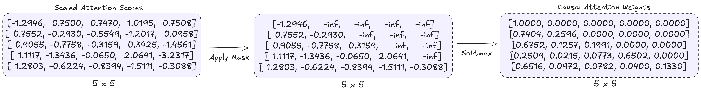
  </a>
</p>

This ensures:

- token 1 sees only itself
- token 2 sees tokens 1 and 2
- token 3 sees tokens 1, 2, and 3

Now each token can only attend to itself and previous tokens. This is the mechanism used in decoder only transformer models like GPT.

## Masked Multi-Head Attention

A single attention mechanism can only learn one type of relationship at a time. To capture grammar, meaning, long-range dependencies, and subject-object relationships simultaneously, the model uses Masked Multi-Head Attention. Multiple attention heads run in parallel, looking at the exact same sentence differently.

For “Every moment is a beginning,” different heads might focus on different nuances:

Attention Head 1 (Meaning): Connects “moment” ←→ “beginning” to understand the concept of renewal.

Attention Head 2 (Grammar): Connects “Every” ←→ “moment” to understand that “Every” is describing “moment”.

Attention Head 3 (Structure): Connects “is”  ←→ “beginning” to anchor the main statement of the sentence.

<p align="center">
  <a href="https://awesomeneuron.substack.com/">
    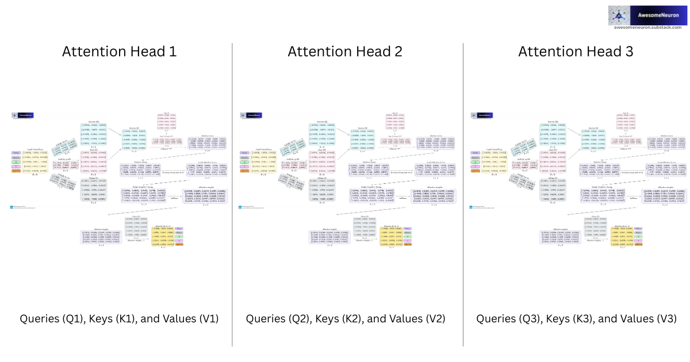
  </a>
</p>

How it works:

- The input embeddings are split into smaller parts called heads.
- Each head performs attention independently.
- The outputs from all heads are concatenated together.
- A final linear layer combines the information into one representation.

## Feedforward Neural Networks

Attention allows tokens to communicate with each other and exchange information across the sequence.

For example, in the sentence:

"Every moment is a beginning."

Attention helps the token "beginning" gather context from words like "moment" and "Every".

But after this information is mixed together, each token still needs additional processing to learn more complex patterns. This is the role of the Feed Forward Network, often called the FFN or MLP block.

A Feedforward Neural Network typically consists of two linear layers with an activation function (like GELU) in between, temporarily expanding the hidden dimension (often by 4x) to help the model learn more complex patterns.

- Linear layer
- Activation function
- Second linear layer

## Residual Connections

Deep neural networks are difficult to train.

As networks become deeper, gradients can become extremely small or extremely large during backpropagation. This is known as the vanishing gradient or exploding gradient problem.

When gradients vanish, earlier layers learn very slowly because the training signal fades as it moves backward through many layers.

Residual connections, also called skip connections, help solve this problem. Instead of learning a completely new transformation, the model learns how to modify the input relative to its original value.

The original input is added back to the output of a layer:

$$\text{Output} = x + \text{Sublayer}(x)$$

Transformers use residual connections around both:

- Masked multi-head attention
- Feedforward neural networks

Residual connections help transformers:

- train deeper networks
- stabilize gradients
- preserve information

They are one of the core building blocks of modern deep learning architectures.

## Layer Normalization

Neural network activations can become unstable during training. As data passes through many layers, the values can grow too large or become too small. This makes optimization difficult and can slow down learning.

Layer Normalization helps stabilize these activations. It normalizes the features of each token independently so that the values maintain:

- mean ≈ 0
- standard deviation ≈ 1

This makes training faster, more stable, and more reliable.

Suppose a token embedding is:

$$x = [x_1, x_2, x_3]$$

LayerNorm computes:

The mean

$$\mu = \frac{1}{n}\sum x_i$$

The variance

$$\sigma^2 = \frac{1}{n}\sum (x_i - \mu)^2$$

The normalized output

$$\hat{x}_i =\frac{x_i - \mu}{\sqrt{\sigma^2 + \epsilon}}$$

This transforms the features so they have approximately zero mean and unit variance.

Layer normalization is applied multiple times inside each transformer block.

## Transformer Block

A transformer block combines:

- Masked multi-head attention
- Feedforward neural network
- Residual connections
- Layer normalization

The flow through a Transformer block is:

- Layer Normalization: Normalizes the input representations to improve training stability.

- Masked Multi-Head Attention: Allows each token to gather information from itself and previous tokens while preventing access to future tokens.

- Residual Connection (Add): The original input is added back to the attention output, helping preserve information and improve gradient flow.

- Layer Normalization: Re-normalizes the updated representations before further processing.

- Feedforward Neural Network (FFN): Applies non linear transformations to learn more complex patterns and relationships.

- Residual Connection (Add): The input from before the second Layer Normalization is added to the FFN output, preserving information while incorporating the new transformations.

Note: Dropout is often applied after the attention and feedforward operations during training. This helps reduce overfitting and improves the model’s ability to generalize.

<p align="center">
  <a href="https://awesomeneuron.substack.com/">
    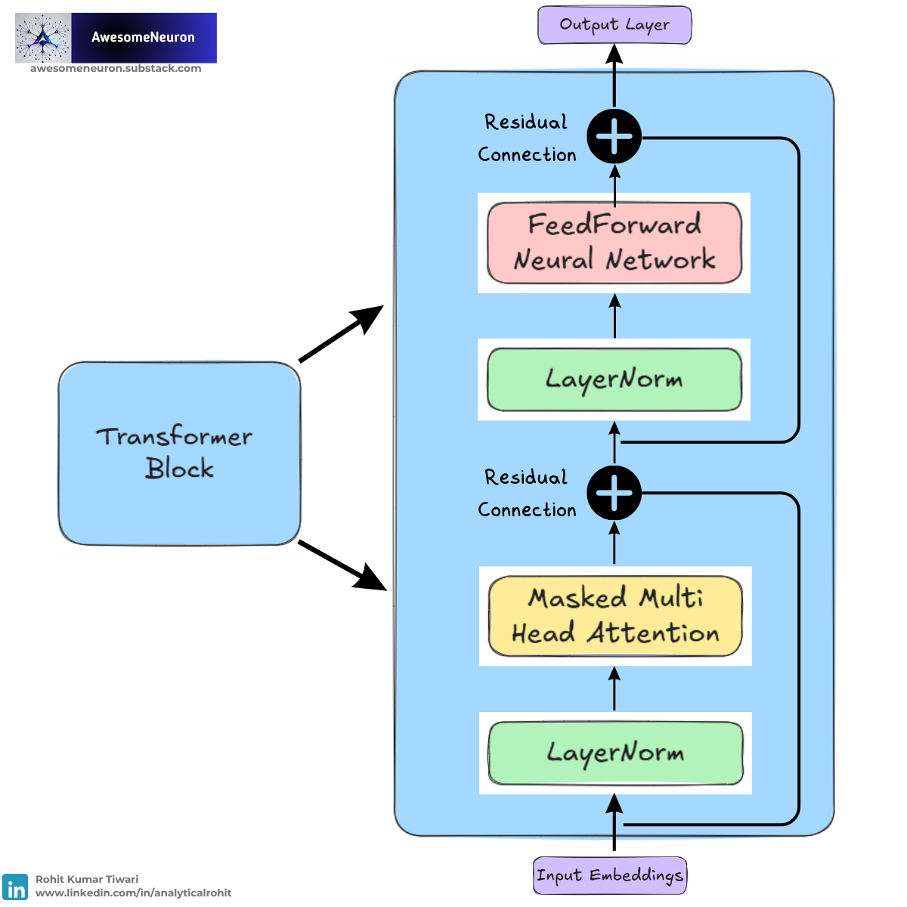
  </a>
</p>

Modern GPT models stack many transformer blocks on top of each other. Each block refines the token representations.

## MiniGPT

`MiniGPT` is a small GPT style language model built using transformer blocks.

<p align="center">
  <a href="https://awesomeneuron.substack.com/">
    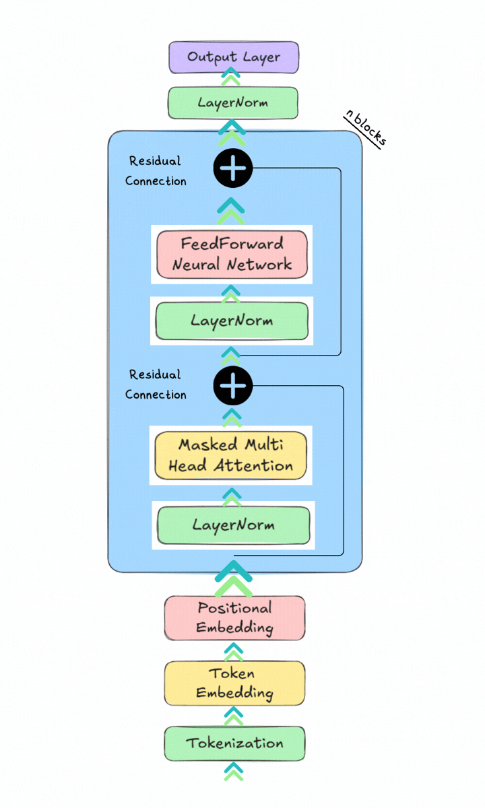
  </a>
</p>

It combines:

- Token embeddings
- Positional embeddings
- Transformer blocks
- Layer normalization
- Output layer

The model processes input tokens and predicts the next token in the sequence.


### Parameters

| Parameter | Description |
|---|---|
| `vocab_size` | Total number of tokens in the vocabulary |
| `block_size` | Maximum sequence length |
| `embed_dim` | Size of token embeddings |
| `num_heads` | Number of attention heads |
| `hidden_dim` | Hidden size of the feedforward neural network |
| `num_layers` | Number of transformer blocks |

### Overall Flow

```text
Input Tokens
     ↓
Token Embeddings
     ↓
Positional Embeddings
     ↓
Transformer Blocks
     ↓
LayerNorm
     ↓
Output Layer
```

MiniGPT is trained autoregressively. It predicts the next token using previous tokens. This is the core idea behind GPT style language models.

## Blog Post

Read the full breakdown and insights in the accompanying blogs.

- [A Visual Guide to LLMs (Part 1): Text to Numbers: Tokenization and Embeddings](https://awesomeneuron.substack.com/p/a-visual-guide-to-llms-part-1)
- [A Visual Guide to LLMs (Part 2): Inside the Transformer Architecture](https://awesomeneuron.substack.com/p/a-visual-guide-to-llms-part-2)

## Newsletter
<div style="text-align: left;">
📌 Join 10,000+ ML enthusiasts and professionals from 150+ countries.<br>
✅ Learn AI for FREE with visuals, easy-to-follow insights.<br>
✅ Get cutting-edge topics like GenAI, RAGs, and LLMs in your inbox every week.
</div>
<br>
<div align="center">

[](https://awesomeneuron.substack.com/)

</div>
<div style="text-align: left;">
    <a href="https://awesomeneuron.substack.com/">
        
</div>
<p align="center">
  <a href="https://awesomeneuron.substack.com/">
    
  </a>
</p>

## Contributing

We welcome contributions! If you have improvements, new notebooks, or fixes to suggest:

1. Fork the repository.
2. Create a feature branch: `git checkout -b feature/YourTopic`.
3. Add or update notebooks in the `notebooks/` folder.
4. Commit your changes: `git commit -m 'Add or update YourTopic notebook'`.
5. Push your branch: `git push origin feature/YourTopic`.
6. Open a pull request for review.

## License

This project is licensed under [MIT License](./LICENSE)

---

⭐️ If you find this repository helpful, please consider giving it a star!

[](https://www.star-history.com/#analyticalrohit/llms-from-scratch&type=date&legend=top-left)

Keywords: AI, Machine Learning, Deep Learning, PyTorch, Generative AI, LLMs, Transformers